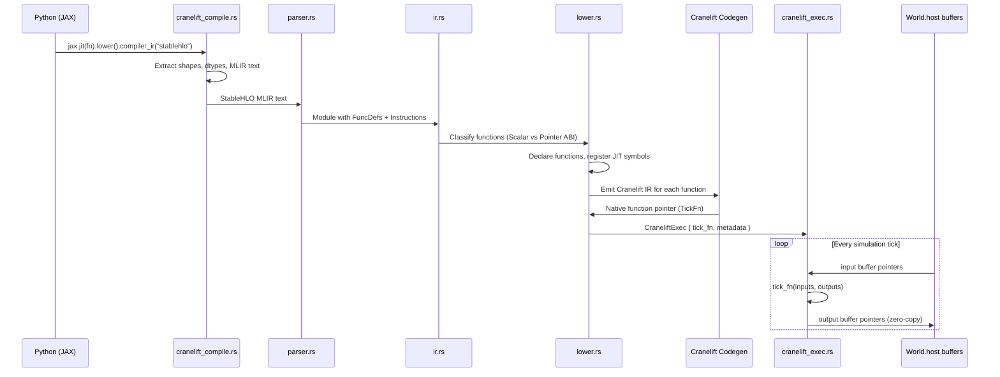
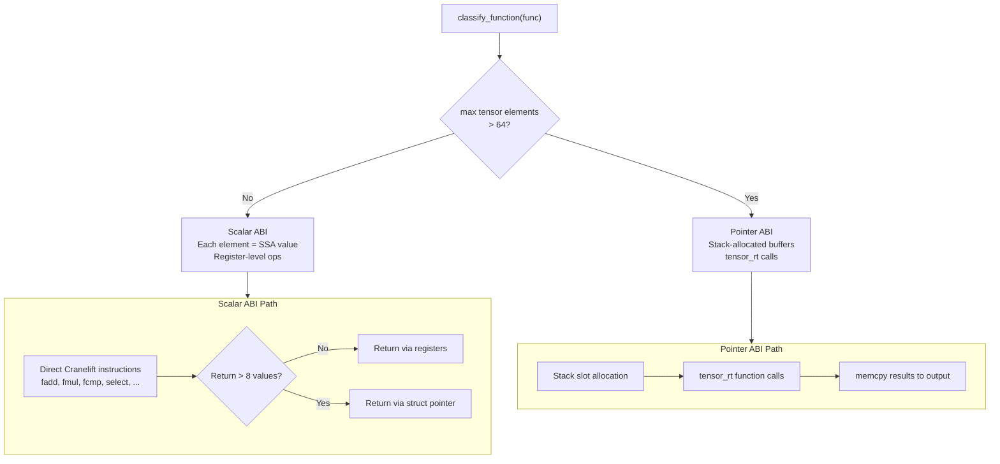
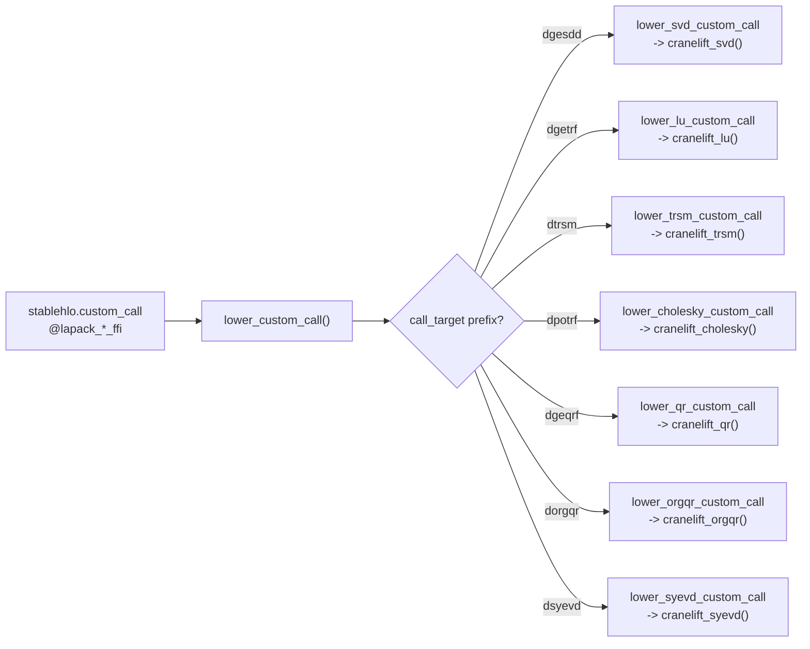
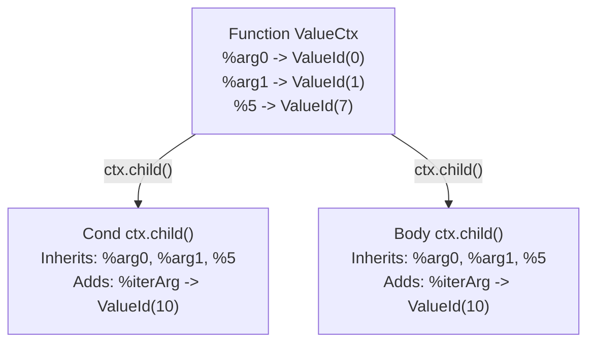

# cranelift-mlir Architecture

A Rust-native JIT compiler that transforms StableHLO MLIR into native machine code via
Cranelift, replacing IREE as the CPU execution backend for Elodin simulations.

## Table of Contents

1. [Motivation](#motivation)
2. [End-to-End Compilation Pipeline](#end-to-end-compilation-pipeline)
3. [Dual ABI Architecture](#dual-abi-architecture)
4. [Tensor Runtime](#tensor-runtime)
5. [LAPACK via faer](#lapack-via-faer)
6. [Gather: The Hardest Op](#gather-the-hardest-op)
7. [While Loop Scoping](#while-loop-scoping)
8. [Checkpoint Diagnostic Tool](#checkpoint-diagnostic-tool)
9. [Testing Strategy](#testing-strategy)
10. [Supported Operations](#supported-operations)
11. [Known Limitations and Future Work](#known-limitations-and-future-work)

---

## Motivation

Elodin simulations are **single-threaded, CPU-bound physics ticks** operating on small,
dense f64 tensors (typically 3-vectors, 4x4 matrices, 6x6 covariance matrices). Each
simulation tick applies a JAX-compiled function to the world state and writes the results
back.

The previous backend, IREE, is designed for large-scale ML inference across heterogeneous
hardware. For Elodin's workloads, IREE's runtime overhead dominates execution time:

- **~30 FFI boundary crossings** per tick (Python -> Rust -> IREE VM -> HAL -> kernel -> back)
- **VM dispatch**: IREE's bytecode interpreter dispatches each operation individually
- **HAL buffer management**: allocation, staging buffers, host-to-device/device-to-host copies
- **Buffer view wrapping**: every tensor access creates typed wrapper objects

The Cranelift path eliminates all of this. A single native function pointer is called
directly on the simulation's host memory buffers, with zero copies and zero dispatch overhead.

### Performance Results

All six regression examples pass with bit-for-bit or tolerance-matched correctness:

| Example | IREE RTF | Cranelift RTF | Speedup | Tensors |
|------------|----------|---------------|---------|---------|
| ball | 79x | ~10,000x | **~130x** | 3-vectors |
| three-body | 29x | ~4,700x | **~160x** | 3-vectors |
| drone | 2.9x | ~300x | **~100x** | 4-vectors, 3x3 |
| rocket | 2.3x | ~33x | **~14x** | 3-vectors, trig |
| linalg-iree| 0.1x | ~800x | **~8,000x** | 6x6, SVD, LU, QR |
| cube-sat | 0.56x | ~3.6x | **~6.4x** | 65x65 (EGM08) |

RTF = Real-Time Factor (higher is better). Measured on Apple Silicon.

The speedup ranges from 6x (cube-sat, dominated by 65x65 matrix operations) to 8,000x
(linalg-iree, where IREE's dispatch overhead per LAPACK call is extreme). The typical
small-simulation speedup is **100-160x**.

---

## End-to-End Compilation Pipeline



### Stage 1: Python to StableHLO

The Python SDK (`nox-py`) traces JAX functions and lowers them to StableHLO MLIR text.
This happens in `libs/nox-py/src/cranelift_compile.rs`:

1. The user's simulation systems are traced by JAX into HLO computation graphs
2. `jax.jit(fn, keep_unused=True).lower(*zero_inputs)` produces a lowered JAX computation
3. `.compiler_ir(dialect="stablehlo")` extracts the StableHLO MLIR as a text string
4. Input/output shapes and dtypes are extracted from the lowered computation metadata

The `keep_unused=True` flag is critical: it preserves all input/output slots even if JAX
determines some are unused, maintaining stable positional mapping between the simulation's
world columns and the function's arguments.

### Stage 2: Parsing (`parser.rs`, ~2,280 lines)

A Winnow-based parser converts StableHLO MLIR text into the internal IR. Key design
decisions:

- **Streaming parser**: processes one instruction at a time, no AST allocation for the
  full module
- **`ValueCtx` scoping**: each parsing context maps SSA names (`%0`, `%arg0`) to internal
  `ValueId`s. While-loop and case blocks use `ctx.child()` to create child contexts that
  inherit the parent's mappings (see [While Loop Scoping](#while-loop-scoping))
- **`backend_config` extraction**: LAPACK custom calls carry parameters like
  `{uplo = 76 : ui8, diag = 85 : ui8}` which are parsed into a `HashMap<String, i64>`

### Stage 3: Internal IR (`ir.rs`, ~439 lines)

A lightweight representation with these key types:

- **`Module`**: collection of `FuncDef`s
- **`FuncDef`**: name, parameters (with types), result types, body (list of `InstrResult`)
- **`Instruction`**: 35+ variants covering arithmetic, comparison, shape manipulation,
  control flow, indexing, LAPACK custom calls, and type conversion
- **`TensorType`**: shape (Vec of i64) + element type (F64, F32, I64, I32, UI32, I1, etc.)
- **`GatherDims`**: offset_dims, collapsed_slice_dims, start_index_map, index_vector_dim
- **`DotDims`**: contracting and batching dimension lists for `dot_general`
- **`ReduceOp`**: Add, Minimum, Maximum, And, Or

### Stage 4: Lowering (`lower.rs`, ~5,917 lines)

The largest and most complex file. Transforms the internal IR into Cranelift IR and
produces a native function pointer. The process:

1. **Function classification**: `classify_all_functions` determines Scalar vs Pointer ABI
   for each function (see [Dual ABI Architecture](#dual-abi-architecture))
2. **JIT symbol registration**: all runtime functions (`tensor_rt`, LAPACK host functions,
   libm math) are registered as symbols the JIT can call
3. **Function declaration**: Cranelift function signatures are created for each IR function
4. **Function definition**: each function body is lowered to Cranelift IR instructions
5. **Finalization**: `module.finalize_definitions()` triggers Cranelift's register
   allocation and machine code emission
6. **Pointer extraction**: `get_main_fn()` returns the native function pointer

The compiled function has the `TickFn` signature:

```rust
type TickFn = unsafe extern "C" fn(*const *const u8, *mut *mut u8);
```

Where `inputs[i]` points to the i-th input tensor's raw bytes and `outputs[i]` points
to the i-th output tensor's pre-allocated buffer.

### Stage 5: Execution (`cranelift_exec.rs`)

`CraneliftExec::invoke_batch` is called every simulation tick:

1. Collects pointers to the world's host buffers (zero-copy)
2. Calls `tick_fn(input_ptrs, output_ptrs)` -- a single native function call
3. No copies, no staging, no VM dispatch

This is the source of the massive speedup: the entire simulation tick is a single
function call into optimized native code operating directly on the simulation's memory.

---

## Dual ABI Architecture

The central architectural decision in cranelift-mlir is the **per-function ABI selection**
that allows small tensors to use fast scalar registers while large tensors use
memory-backed operations.



### Why Dual ABI?

Three alternatives were evaluated:

1. **All-Scalar**: Every tensor element is a separate Cranelift SSA value. This delivers
   ~150x speedup for small simulations but **hangs** on large tensors. A 65x65 matrix
   produces 4,225 SSA values per tensor, leading to ~25,000+ SSA values in a single
   function. Cranelift's register allocator has roughly O(N log N) complexity in SSA
   count, causing compilation times of minutes or outright hangs.

2. **All-Pointer**: Every tensor is a stack-allocated buffer, even 3-element vectors.
   This works for all sizes but sacrifices the register-level performance that produces
   the 100-160x speedup on small simulations. Benchmarks showed ~10x slower than
   scalar for small tensors.

3. **Per-Function Dual ABI** (chosen): Each function is classified independently based
   on the maximum tensor size across its parameters, return types, and body. Functions
   with all tensors <= 64 elements use scalar ABI; any tensor > 64 triggers pointer ABI
   for the entire function. Cross-ABI calls are marshaled at call boundaries.

The threshold of **64 elements** was chosen empirically: it covers all common aerospace
tensors (up to 8x8 matrices) while keeping 65x65 and larger in the pointer path.

### Cross-ABI Marshaling

When a scalar-ABI function calls a pointer-ABI callee:

1. **Pack**: scalar SSA values are stored into a stack-allocated buffer
2. **Call**: the pointer-ABI function is called with buffer pointers
3. **Unpack**: results are loaded back from the output buffer into scalar SSA values

When a pointer-ABI function calls a scalar-ABI callee, the reverse happens.

The `main` function always uses pointer ABI (it receives raw byte pointers from the
simulation runtime), so calls from `main` to scalar callees always marshal.

---

## Tensor Runtime

The tensor runtime (`tensor_rt.rs`, ~1,130 lines) provides `extern "C"` functions for
N-dimensional tensor operations. These are called by pointer-ABI code when operations
can't be expressed as simple Cranelift instructions on individual SSA values.

All functions operate on raw `*mut u8` / `*const u8` pointers with explicit element
counts and shapes passed as parameters. They are registered as JIT symbols during
compilation:

```rust
jit_builder.symbol("tensor_add_f64", tensor_add_f64 as *const u8);
jit_builder.symbol("tensor_broadcast_nd_f64", tensor_broadcast_nd_f64 as *const u8);
// ... ~40 registered symbols
```

### Categories

| Category | Functions | Notes |
|----------|-----------|-------|
| Elementwise | add, sub, mul, div, negate, sqrt, abs, ... | f64, i64, i32 variants |
| Broadcast | broadcast_f64, broadcast_nd_f64, broadcast_i32 | N-D shape-aware |
| Shape | transpose_f64, transpose_nd_f64, concat_nd_f64 | Element-size-aware concat |
| Reduce | reduce_sum_f64, reduce_max_f64, reduce_min_f64 | Outer x inner dimensions |
| Indexing | gather_f64, gather_nd_f64, scatter_f64 | N-D with element-size param |
| Dynamic | dynamic_slice_f64, dynamic_update_slice_f64 | Runtime index values |
| Utility | memcpy, select_f64, iota_nd_f64 | |

### Element-Size Awareness

A critical correctness detail: several runtime functions accept an `elem_sz` parameter
to handle mixed-type tensors. For example, `tensor_concat_nd_f64` operates on raw bytes
with an explicit element size. This was added after discovering that concatenating
`tensor<65x1xi32>` data (4 bytes per element) as if it were f64 (8 bytes) corrupted
index tensors used by the EGM08 gravity model's N-D gather.

---

## LAPACK via faer

JAX lowers `jnp.linalg.*` operations to LAPACK calls encoded as StableHLO custom calls:

```
%0:5 = stablehlo.custom_call @lapack_dgesdd_ffi(%arg0) {
    mhlo.backend_config = {mode = 83 : ui8},
    ...
}
```

The cranelift-mlir crate dispatches these to host functions implemented using
[faer](https://github.com/sarah-ek/faer-rs), a pure-Rust linear algebra library.

### Dispatch Architecture



### Implementation Pattern

Each LAPACK handler follows the same pattern:

1. **Read** input tensor SSA values from the value map
2. **Allocate** a Cranelift stack slot for inputs + outputs
3. **Store** input values into the stack slot
4. **Emit** a call to the registered host function symbol
5. **Load** output values from the stack slot back into SSA values

The host functions (`extern "C"`) handle:
- Row-major (IR convention) to column-major (faer convention) conversion
- Calling the appropriate faer API
- Converting results back to row-major

### Seven LAPACK Targets

| Target | Operation | faer API | Notes |
|--------|-----------|----------|-------|
| `dgesdd` | SVD | `mat.thin_svd()` | Result order: (A_overwritten, sigma, U, VT, info) |
| `dgetrf` | LU factorization | Manual implementation | 1-indexed sequential swap pivots |
| `dtrsm` | Triangular solve | `solve_*_triangular_in_place` | Uses backend_config for uplo/diag |
| `dpotrf` | Cholesky (LLT) | `cholesky_in_place` | Zeros strict upper triangle |
| `dgeqrf` | QR factorization | `qr_in_place` | Extracts tau from block Householder |
| `dorgqr` | Q from packed QR | `apply_block_householder_*` | Reconstructs Q via Householder |
| `dsyevd` | Symmetric eigendecomp | `SelfAdjointEigendecomposition` | Eigenvalues in ascending order |

### Key Design Decisions

**Manual LU instead of faer**: LAPACK's `dgetrf` returns **1-indexed sequential swap
pivots** (`ipiv[k]` = row swapped with row k at step k). faer's `lu_in_place` returns a
**final permutation vector**, which cannot be trivially converted back to the sequential
swap format. Since the StableHLO code immediately processes the pivot array expecting
LAPACK semantics (subtract 1, iterate swaps via a while loop), a manual partial-pivot LU
was implemented to produce compatible pivots.

**SVD result ordering**: XLA's `dgesdd_ffi` returns results in the order
`(A_overwritten, sigma, U, VT, info)`. With JOBZ='S', the overwritten A buffer contains
U. The SVD wrapper function in the MLIR accesses `%0#2` for U and `%0#3` for VT, so
position [2] must contain U and position [3] must contain VT. An early bug returned
`(U, sigma, VT, zeros, info)` which put VT where U was expected, causing `pinv()` to
return all zeros and completely disabling every Kalman filter measurement update.

---

## Gather: The Hardest Op

`stablehlo.gather` is parameterized by five attributes that together describe an
arbitrarily complex indexing operation:

- **`offset_dims`**: which output dimensions correspond to slices from the source
- **`collapsed_slice_dims`**: which source dimensions are sliced to size 1 and removed
- **`start_index_map`**: which source dimensions the index values address
- **`index_vector_dim`**: which dimension of the indices tensor holds the index vectors
- **`slice_sizes`**: the size of each slice taken from the source

### Patterns Encountered

Four distinct gather patterns appear across the simulation examples:

**1. Row-select** (ball, drone, rocket):
```
gather(tensor<6x3xf64>, tensor<6x1xi32>) -> tensor<6x3xf64>
  offset_dims=[1], collapsed=[0], start_index_map=[0], index_vector_dim=1
  slice_sizes=[1, 3]
```
Each index selects a complete row from a 2D tensor.

**2. N-D multi-index** (cube-sat EGM08):
```
gather(tensor<65x65xf64>, tensor<65x2xi32>) -> tensor<65xf64>
  offset_dims=[], collapsed=[0,1], start_index_map=[0,1], index_vector_dim=1
  slice_sizes=[1, 1]
```
Each index row is a (row, col) coordinate pair. Used for gathering elements from a
large coefficient matrix.

**3. 3D pivot permutation** (linalg-iree LU solve):
```
gather(tensor<2x3x1xf64>, tensor<3x1xi32>) -> tensor<2x3x1xf64>
  offset_dims=[0,2], collapsed=[1], start_index_map=[1], index_vector_dim=1
  slice_sizes=[2, 1, 1]
```
Permutes along the middle dimension of a 3D tensor based on pivot indices. The key
detail is `start_index_map=[1]` -- the indices address dimension 1 (not 0).

**4. Diagonal extraction** (linalg-iree determinant):
```
gather(tensor<3x3xf64>, tensor<3x2xi32>) -> tensor<3xf64>
  offset_dims=[], collapsed=[0,1], start_index_map=[0,1], index_vector_dim=1
  slice_sizes=[1, 1]
```
Each index row is a (row, col) pair for diagonal elements: (0,0), (1,1), (2,2).

### Implementation

The **scalar-path** gather uses a general N-D algorithm: for each output element, it
decomposes the output index into batch and offset parts, looks up start indices from the
index tensor, applies `start_index_map` to compute source coordinates, and emits a
dynamic load. All shape math is computed at compile time; only the index values are
runtime SSA values.

The **pointer-ABI path** delegates to `tensor_gather_nd_f64`, a runtime function that
performs the same algorithm at execution time with explicit shape/stride arrays.

---

## While Loop Scoping

StableHLO while loops have condition and body blocks that can reference values defined
outside the loop (function parameters, constants). The parser must correctly resolve
these references.



### The Bug That Wasn't Obvious

An early implementation used `ValueCtx::new()` (blank contexts) for while-loop condition
and body blocks. This worked for simple loops where the body only referenced iteration
arguments. But when a while-loop body referenced an outer-scope variable (like a function
parameter or a constant defined before the loop), `get_or_create` assigned a **fresh
ValueId** that collided with the iteration argument slots.

This caused data corruption: the while-loop body would read from the wrong memory
location, producing garbage values. In the cube-sat example, this manifested as a
37,000x error in the gravity force magnitude, because the Legendre polynomial computation
inside a while loop was reading corrupted coefficients.

The fix: `parse_while_op` now uses `ctx.child()` for both `cond_ctx` and `body_ctx`,
which clones the parent's `name_to_id` mappings. The `iter_arg_ids` assigned by the
parser are stored in the `Instruction::While` variant and used by both the scalar and
pointer-ABI lowering handlers.

---

## Checkpoint Diagnostic Tool

A reusable workflow for diagnosing any compilation correctness bug by comparing
Cranelift JIT output against XLA reference values.

### Generating a Checkpoint

```bash
ELODIN_BACKEND=cranelift \
ELODIN_CRANELIFT_CHECKPOINT_DIR=/tmp/ckpt \
  bash scripts/ci/regress.sh <example> examples/<example>/main.py
```

This captures on the first tick:
- `input_N.bin`: raw input buffer bytes
- `cranelift_output_N.bin`: Cranelift JIT output bytes
- `xla_output_N.bin`: XLA reference output bytes (computed by running the original JAX function)
- `stablehlo.mlir`: the MLIR text
- `checkpoint.json`: metadata (shapes, dtypes, slot counts)

### Verifying with the Rust Test

```bash
CHECKPOINT_DIR=/tmp/ckpt \
  cargo test -p cranelift-mlir --test checkpoint_test --release -- --ignored --nocapture
```

The verifier compiles the MLIR with Cranelift, feeds the checkpoint inputs, and compares
each output element against the XLA reference. It reports the first mismatching element
with its index, expected value, and actual value.

### MLIR Bisection

When a complex function (hundreds of operations) produces wrong output, the checkpoint
tool enables systematic bisection:

1. Modify the checkpoint's `stablehlo.mlir` to expose intermediate values as additional
   return values from the function
2. Regenerate the XLA reference (re-run with checkpoint enabled)
3. Run the verifier to identify which intermediate diverges
4. Repeat with finer granularity until the root cause operation is isolated

This technique was used to identify the `tensor_concat_nd_f64` element-size bug in the
cube-sat EGM08 gravity model, narrowing down from 669 operations to the single concat
that was corrupting i32 index data.

---

## Testing Strategy

### Test Organization

| Test Binary | Tests | Purpose |
|-------------|-------|---------|
| `ops.rs` | 123 | Per-op golden-value tests (scalar + pointer ABI) |
| `checkpoint_test.rs` | 1 (ignored) | Checkpoint verifier (needs CHECKPOINT_DIR) |
| `ball_e2e.rs` | 7 | Parse + compile ball MLIR |
| `three_body_e2e.rs` | 2 | Parse + compile three-body MLIR |
| `drone_e2e.rs` | 2 | Parse + compile drone MLIR |
| `rocket_e2e.rs` | 2 | Parse + compile rocket MLIR |
| `cube_sat_e2e.rs` | 2 | Parse + compile cube-sat MLIR |
| `linalg_iree_e2e.rs` | 2 | Parse + compile linalg-iree MLIR |
| `drone_tick_test.rs` | 6 | Full tick execution with value checks |
| Other integration tests | ~25 | Specific patterns: threefry, sret, dynamic ops, etc. |

**Total: 172+ tests across 19 test binaries.**

### Testing Philosophy

- **Every supported op** has golden-value tests comparing Cranelift output against
  hand-computed expected values
- **Both ABI paths** are tested: functions ending in `_mem` test the pointer-ABI path
- **E2E tests** parse and compile the full MLIR from each example to catch parser and
  lowering regressions
- **Regression suite** (`scripts/ci/regress.sh --all`) runs all six examples end-to-end,
  comparing CSV outputs against committed baselines with configurable per-file tolerances

### Quick Commands

```bash
cargo test -p cranelift-mlir                    # all tests
cargo test -p cranelift-mlir --test ops         # 123 per-op tests
cargo test -p cranelift-mlir --release          # all tests (needed for complex JIT code)
ELODIN_BACKEND=cranelift bash scripts/ci/regress.sh --all  # full regression suite
```

---

## Supported Operations

### Arithmetic
| Op | Tested | Notes |
|----|--------|-------|
| stablehlo.add | yes | float + integer |
| stablehlo.subtract | yes | float + integer |
| stablehlo.multiply | yes | float + integer |
| stablehlo.divide | yes | float + signed/unsigned integer |
| stablehlo.negate | yes | float + integer |
| stablehlo.sqrt | yes | inline Cranelift instruction |
| stablehlo.power | yes | via libm pow |
| stablehlo.maximum | yes | float |
| stablehlo.minimum | yes | float |
| stablehlo.abs | yes | float |
| stablehlo.floor | yes | float |
| stablehlo.sign | yes | float |
| stablehlo.remainder | yes | float + integer |
| stablehlo.sine | yes | via libm |
| stablehlo.cosine | yes | via libm |
| stablehlo.tanh | yes | via libm |
| stablehlo.exponential | yes | via libm |
| stablehlo.log | yes | via libm |
| chlo.tan | yes | via libm |
| chlo.acos | yes | via libm |
| chlo.erf_inv | yes | Cephes ndtri-based, ~15 digits f64 |

### Comparison and Selection
| Op | Tested | Notes |
|----|--------|-------|
| stablehlo.compare | yes | all directions, float/signed/unsigned, i32/i64 |
| stablehlo.select | yes | f64/i32/i64 with scalar or tensor i1 mask |

### Constants
| Op | Tested | Notes |
|----|--------|-------|
| stablehlo.constant | yes | scalar, dense array, splat, hex blobs |

### Shape Manipulation
| Op | Tested | Notes |
|----|--------|-------|
| stablehlo.reshape | yes | arbitrary shape changes |
| stablehlo.broadcast_in_dim | yes | N-dimensional with dims mapping |
| stablehlo.slice | yes | N-dimensional |
| stablehlo.concatenate | yes | any dimension, multi-operand |
| stablehlo.transpose | yes | 2D + N-D |
| stablehlo.pad | yes | N-dimensional |
| stablehlo.reverse | yes | |
| stablehlo.iota | yes | N-dimensional with dimension parameter, f64 + i64 |

### Dynamic Indexing
| Op | Tested | Notes |
|----|--------|-------|
| stablehlo.dynamic_slice | yes | N-dimensional, runtime indices |
| stablehlo.dynamic_update_slice | yes | N-dimensional, runtime indices |

### Type Conversion
| Op | Tested | Notes |
|----|--------|-------|
| stablehlo.convert | yes | all numeric type pairs (f64/f32/i64/i32/ui32/ui64/i1) |
| stablehlo.bitcast_convert | yes | reinterpret bits |

### Integer Bitwise
| Op | Tested | Notes |
|----|--------|-------|
| stablehlo.xor | yes | |
| stablehlo.or | yes | |
| stablehlo.and | yes | |
| stablehlo.shift_left | yes | |
| stablehlo.shift_right_logical | yes | |

### Linear Algebra
| Op | Tested | Notes |
|----|--------|-------|
| stablehlo.dot_general | yes | scalar, 1D dot, rank1-rank2, matvec, matmul, batched |
| stablehlo.reduce | yes | add/min/max/and/or, all dimensions |

### Indexing
| Op | Tested | Notes |
|----|--------|-------|
| stablehlo.gather | yes | row-select, N-D multi-index, 3D pivot, diagonal |
| stablehlo.scatter | yes | 1D index-set with i32/i64 indices |

### Control Flow
| Op | Tested | Notes |
|----|--------|-------|
| stablehlo.while | yes | outer-scope access, cross-ABI calls, nested |
| stablehlo.case | yes | multi-branch dispatch |
| func.call | yes | scalar ABI, sret, pointer ABI, cross-ABI marshaling |

### LAPACK Custom Calls
| Op | Tested | Notes |
|----|--------|-------|
| lapack_dgesdd_ffi | yes | SVD via faer thin_svd |
| lapack_dgetrf_ffi | yes | LU via manual partial pivot |
| lapack_dtrsm_ffi | yes | triangular solve via faer |
| lapack_dpotrf_ffi | yes | Cholesky via faer |
| lapack_dgeqrf_ffi | yes | QR via faer |
| lapack_dorgqr_ffi | yes | Q extraction via Householder |
| lapack_dsyevd_ffi | yes | symmetric eigendecomp via faer |

---

## Known Limitations and Future Work

### Current Limitations

- **No SIMD vectorization**: all operations use scalar Cranelift instructions. faer uses
  SIMD internally for LAPACK operations, but the main tensor operations are scalar.
  Future optimization could use Cranelift's SIMD support or delegate more operations to
  faer/BLAS.

- **Debug-mode UB checks**: in debug builds, some complex JIT functions trigger
  `ptr::copy_nonoverlapping` precondition checks in Rust's standard library. This is a
  Cranelift limitation with large stack frames. Use `--release` for checkpoint
  verification and complex examples.

- **Stack overflow risk**: deeply nested functions with many while loops (e.g., cube-sat's
  `inner_375` with 5 while loops) can overflow the default thread stack. The checkpoint
  test uses a 64MB thread stack as a workaround.

- **CPU-only**: no GPU execution path. The design is intentionally optimized for
  single-threaded CPU physics ticks.

- **LU pivot format**: the manual LU implementation could be replaced with faer's
  optimized version once a reliable permutation-to-sequential-swap conversion is
  validated. The current implementation is correct but not BLAS-optimized.

### Future Opportunities

- **SIMD**: Cranelift supports SIMD types and instructions. Elementwise operations on
  small tensors could be vectorized (e.g., 4-wide f64 for 3-vectors with padding).

- **Compile-time constant folding**: operations on constant tensors could be evaluated
  at compile time rather than generating code that computes them at each tick.

- **Memory layout optimization**: the current row-major layout could be optimized for
  specific access patterns (e.g., column-major for matrix multiply chains).

- **Parallel compilation**: functions could be compiled in parallel since they are
  independent after classification.
